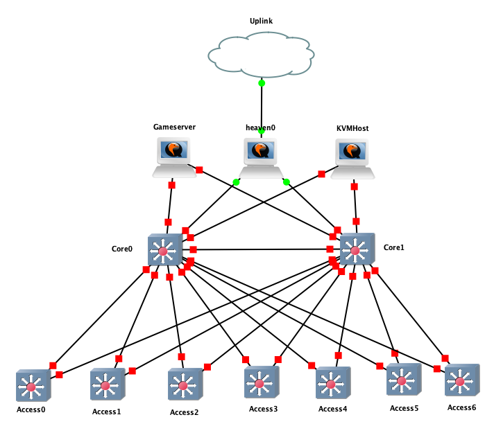

# Lanarama Infrastructure & Server Setup

Goal of these ansible playbooks is a working VM host which can advertise its networks via BGP.

## Network topology


Core Switches: Arista DCS7050-SX-64
Access Switches: Penguin Computing 4804i-r

### BGP Peering configuration
`core0` and `core1` are members of the AS64666 and peer with heaven0 (upstream gateway, AS65000). Access Switches have their own AS numbers (AS64701, AS64702, ...). Servers also have their own AS (AS65001, AS65002, ...). Every AS (except core and uplink) spin up their own `/24` IPv4 and `/64` IPv6 network. The IPv4 Network should be in the private range and will be NATed by the upstream gatway. IPv6 is just routed (and firewalled)!
Core network has ECMP routing enabled with up to 4 ECMP path. This value might be increased if needed.

#### IP Ranges
1. IPv4
  - Access Switches: `192.168.<access-nr>.0/24` (access-nr < 200), e.g. `192.168.2.0/24` for Access Switch 2
  - Servers Switches: `192.168.<200 + server-nr>.0/24` (server-nr > 200), e.g. `192.168.200.0/24` for Server 0
2. IPv6 tbd, depending on what we'll get.

#### Peering configuration
> **ATTENTION** The BGP daemon on the core switches is listening only on the IPv6 address range! (more specific: `fc00::/16`)

Peering is possible at the coreswitches on Port 1-16 (10 Gbit) as well as 49-52 (40 Gbit, 51 and 52 split up to 4x10G for Server connections) following this schema (IPv4, IPv6). All ASes are accepted!
```
  10.<core-id>.<port-index>.1/30
  fc00:<core-id>:<port-index>::1/126
```

## Infrastructure
- Edge Router / Firewall (WAN transfer net, BGP internal)
- KVM host which contains VMs running infrastructure and monitoring services (attached via BGP)
- Gameserver (tbd)

## Infrastructure Services & Monitoring
- DHCP Server (kea) with PSQL as database backend
- DNS Server (probably CoreDNS) tbd
- Prometheus for stats monitoring
- Elasticsearch for traffic monitoring/analysis

## Bootstrapping
Bootstrapping and maintaining the infrastructure is done with the help of `ansible` (configuration management) and `terraform` (stateful environment setup).
There is a `Makefile` containing all necesarry targets and their dependend tasks:

1. Run the `base.yaml` playbook which setups the KVM host(s) and hopefully the gateway.
2. Traverse into the `terraform` subdirectory and execute `terraform apply` which connects to the KVM host(s) and creats VMs with initial configuration
3. Run an additional ansible playbook which setups everything else (still on the TODO list)


## Used tooling

### Libvirt
Libvirt is used as the backend for the KVM host. [Terraform](https://www.terraform.io) connects to the backend and creates specified VMs. It shouldn't be required to manually intersect this process, however you can do it with `virsh`. For debugging it is quite handy to show usage statistics using `virt-top`

### FRR
We are using [frrouting](https://frrouting.org) as a routing daemon on linux systems (more specific, advertising internal subnets via BGP). Frr is also configuring IP addresses of the interfaces.
Privileged users can enter the configuration shell (similar to cisco) with:
```
sudo vtysh
```

# DO READ THIS!!!
- DHCP has to run on a **fucking physical interface** and **not a bridge**.
- Don't add any kernel routes (e.g. with iproute 2) on the arista switches. It **will** break routing!
